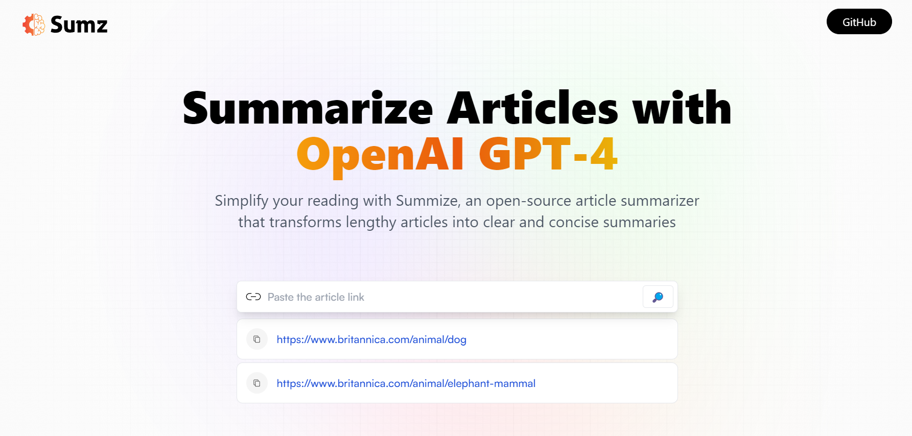

  
   

  <h2 align="center">AI - Article Summarizer</h2>

 A content summarizer website leveraging the OpenAI API, allows users to input links of articles and web pages, extract the concise summaries from the articles and web pages. 
  
 Implemented a user-friendly interface, demonstrating expertise in front-end development and user experience design.

  <a href="https://aicontentsummarizer.netlify.app"><strong>➥ Live Demo</strong></a>

 

### Demo Screeshots

